## Page 78

The link or citation is apparently broken.

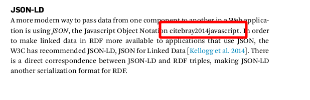

In the print edition, this is on page 61

## Page 84

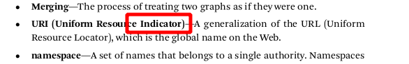

Perhaps the word **Identifier** was meant, like in https://tools.ietf.org/html/rfc3986.

On the same page, I think the word None should not be there:

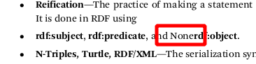

Also, maybe in the list of serialization formats on the next line, N3, TriG and N-Quads might also be mentioned.

These observations are all correct. This is page 67 in the print edition. 

## Page 103

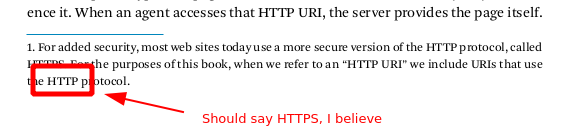

## Page 105

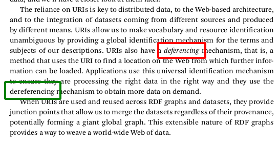

I believe the word `deferencing` in the red rectangle should be `dereferencing`, just as it is written a few lines below.

## Page 111

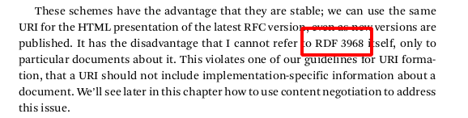

I guess it should say `RFC 3968`.

## Page 120

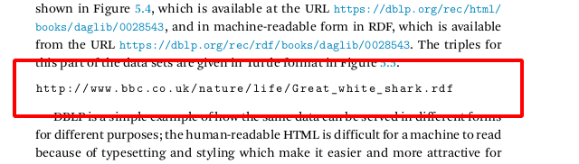

This link seems out of its place. This section is about DBLP, but the link is about BBC and lacks any comments as to its meaning. In addition, it seems to lead to an HTTP 404 page.

## Page 150

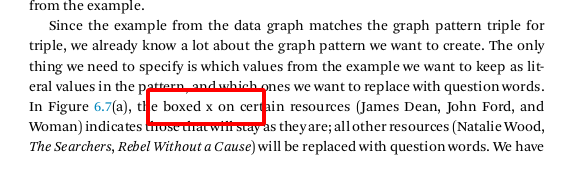

I believe the diagram actually uses checkmark character :heavy_check_mark: to potray these items, not a boxed `x`.

## Page 217

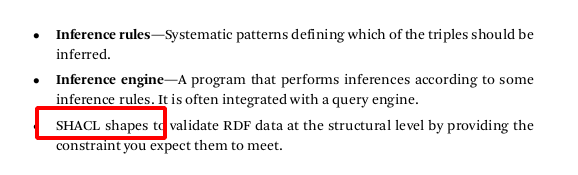

I believe the words `SHACL shapes` should be in bold, just as the other terms in the **Fundamental concepts** list.

## Page 458

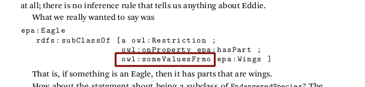

## Page 462

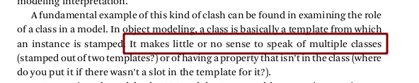

Multiple inheritance, where a subclass is derived from multiple classes, does exist in many programming languages, in Python for example. The object is considered an instance of every class in the inheritance hierarchy.
